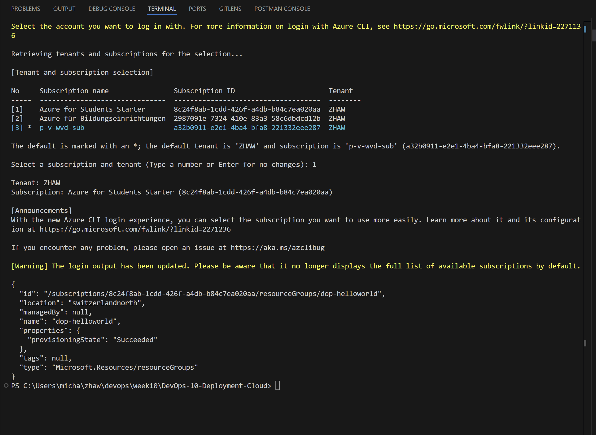
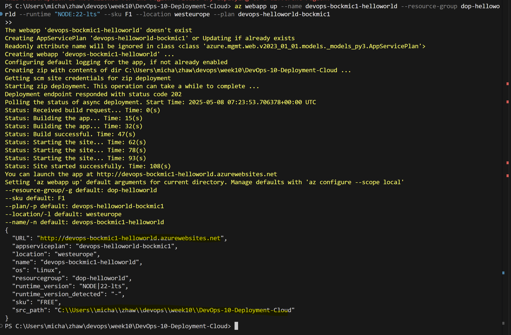
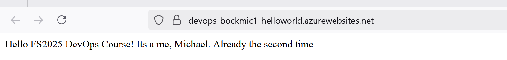
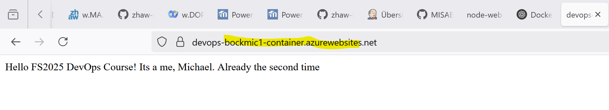
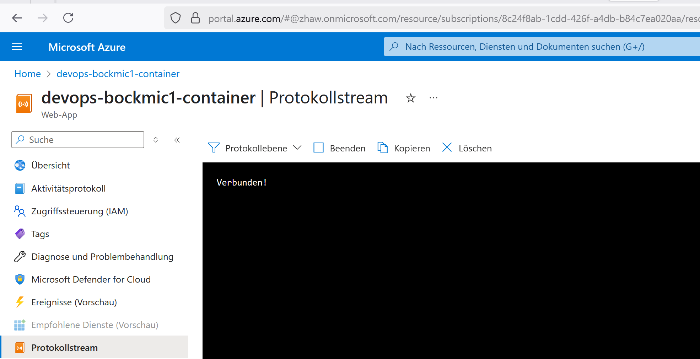
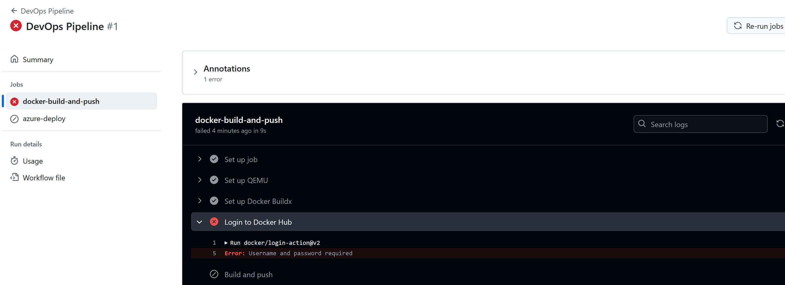
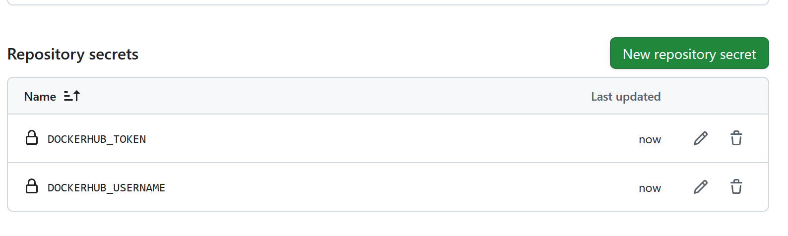
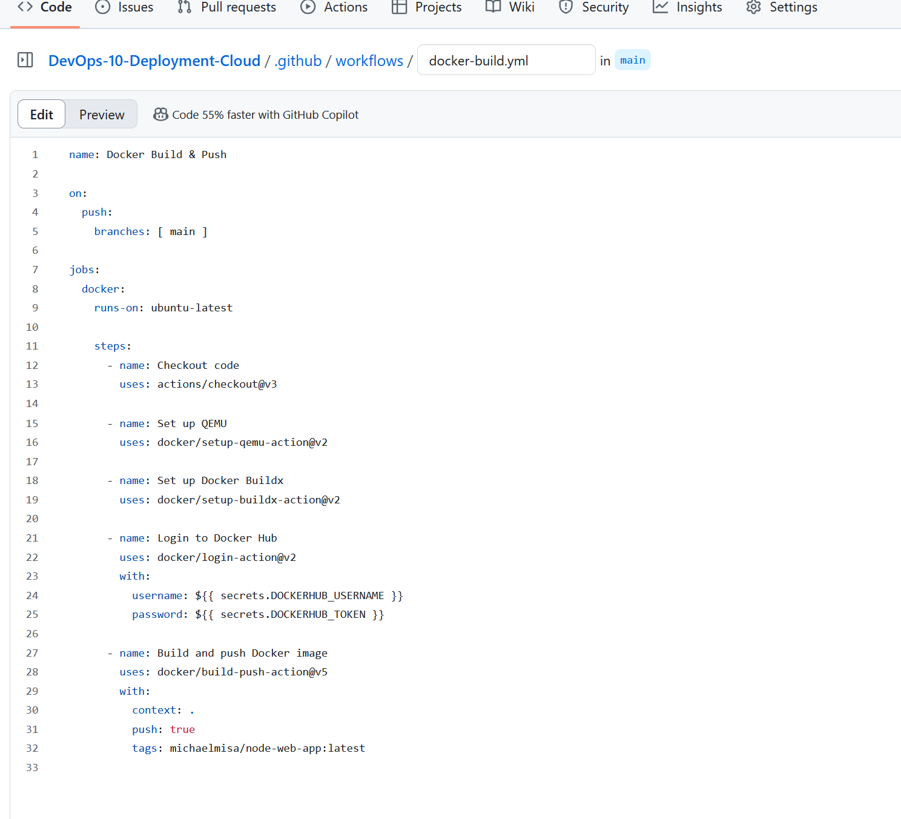
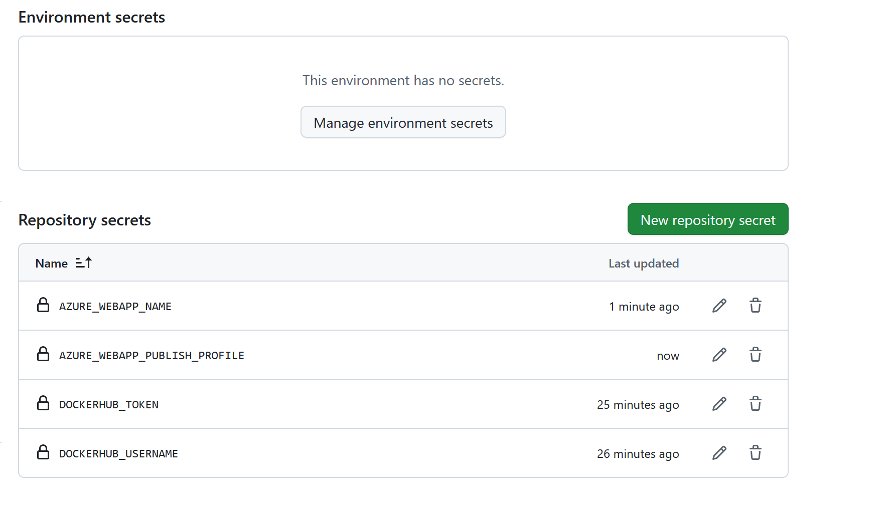

# DevOps 10 Deployment Cloud

## URL

| App-Name | Repo URL | Docker Hub URL |
| -------- | ------- | ------- |
| DevOpsXYZ | https://hub.docker.com/repository/docker/mosazhaw/node-web-app/general | https://github.com/devopszhaw/DevOps-10-Deployment-Cloud |

## Lernjournal

Als erstes habe ich mich mit meinem Azure Account angemeldet und die Ressource dop-helloworld erstellt.
()

dannach die App auf Azure uploaded: 
()

()

Als nächstes habe ich die Applikation in einem Web-App-Container gestartet: 
()

Hier die Logs:
()

Ich habe die Devops Pipeline für mein Projekt gestartet und gesehen, dass ich zuerst die Tokens für den Docker-Hub Zugang erfassen muss 
()

Das habe ich dann hier erstellt: 
()

Als weiteres die Docker-Build.yaml Datei hinzugefügt: 
()

Auch die Azure Credentials musste ich an Github übergeben, damit dieser Zugriff auf das Azure Projekt hat: 
()

